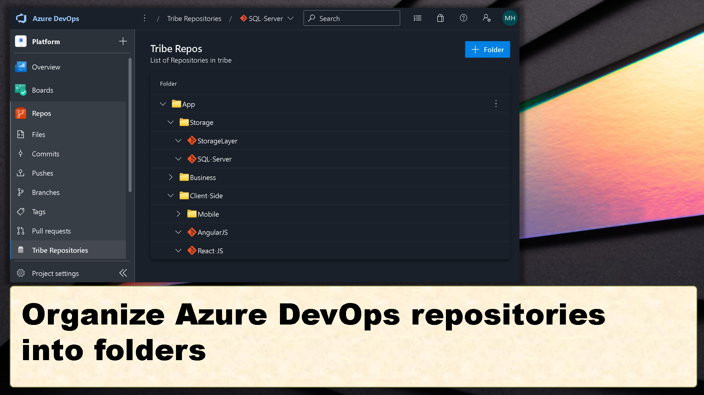

# azure-repo-folder-extension
Azure DevOps extension that allows organizing large number of repositories into folders for better visualization.



# How to build 
Microsoft has great documentation how to create extensions. This repository took the Microsoft sample and modified it. You can build it like following:

```
 npm build
```
Once the build is completed successfully, you can publish it as extension and deploy it to your organization.

```
 package-extension
```

### License
The code is provided as-is. You can modify/change anyway you want. The author doesn't take any responsiblity to provide any kind of support. 
However, If you get benefit of this, an acknowledgement would be highly appreciated.